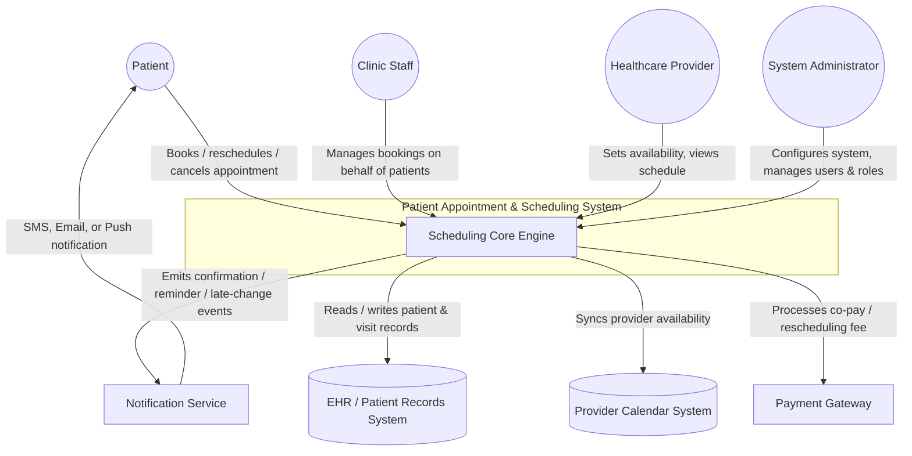

## System Context Diagram — Patient Appointment & Scheduling System (PASS)

This diagram shows the Patient Appointment & Scheduling System (PASS) as a single system boundary interacting with its external actors and supporting services.

**Actors (human users):**
- **Patient** — books, reschedules, and cancels their own appointments
- **Clinic Staff** — manages bookings on behalf of patients who call or walk in
- **Healthcare Provider** — sets availability and views their schedule
- **System Administrator** — configures the system and manages user roles

**External systems (integration points, not built by this team):**
- **Notification Service** — receives events from the Scheduling Core Engine and delivers reminders, confirmations, and late-change alerts to patients via SMS, email, or push notification
- **EHR / Patient Records System** — stores and retrieves patient and visit records
- **Provider Calendar System** — keeps provider availability synchronized with external scheduling tools
- **Payment Gateway** — processes co-pays and rescheduling fees where applicable

The **Scheduling Core Engine** sits at the center as the system's boundary: everything inside the `PASS` subgraph is what the team is responsible for building, while everything outside it represents a dependency the system talks to but does not own. This distinction matters for scoping — it clarifies which failures are "our bug" versus "an integration issue with a third-party service."

