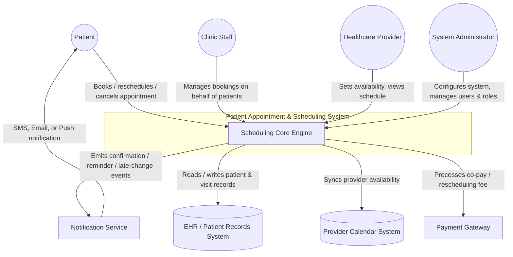

```mermaid
graph TB
    Patient((Patient))
    Staff((Clinic Staff))
    Provider((Healthcare Provider))
    Admin((System Administrator))

    subgraph PASS["Patient Appointment & Scheduling System"]
        Core[Scheduling Core Engine]
    end

    Notif[Notification Service]
    EHR[(EHR / Patient Records System)]
    Calendar[(Provider Calendar System)]
    Payment[Payment Gateway]

    Patient -->|Books / reschedules / cancels appointment| Core
    Staff -->|Manages bookings on behalf of patients| Core
    Provider -->|Sets availability, views schedule| Core
    Admin -->|Configures system, manages users & roles| Core

    Core -->|Emits confirmation / reminder / late-change events| Notif
    Notif -->|SMS, Email, or Push notification| Patient

    Core -->|Reads / writes patient & visit records| EHR
    Core -->|Syncs provider availability| Calendar
    Core -->|Processes co-pay / rescheduling fee| Payment
```
